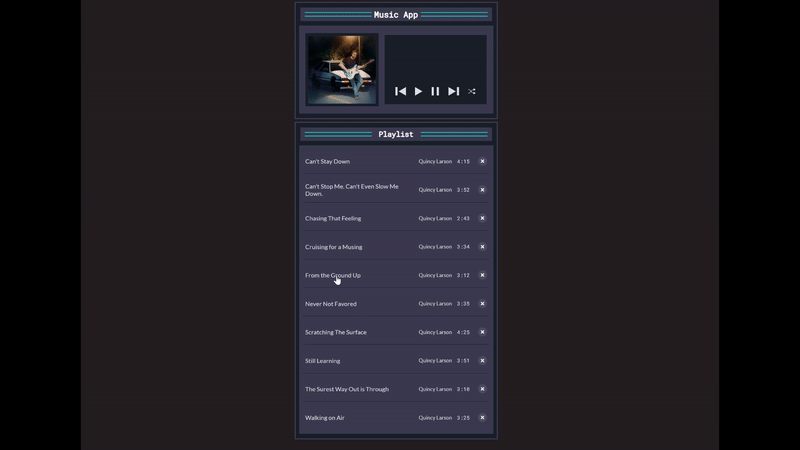

# Welcome to my Music App!

Active Link: https://music-app-jet-two.vercel.app/

## Demo

  
## Overview
This is a fully functional browser-based music player built using HTML, CSS, and vanilla JavaScript. The app features a clean and accessible UI with the following capabilities:

▶️ Play, Pause, Next, and Previous song controls

🔀 Shuffle functionality that randomizes the playlist

🗑️ Delete individual songs from the current playlist

♻️ Reset option when the playlist is empty

🎧 Live song title and artist display

🧠 State management for tracking current song and play position

🧩 Fully modular code using event-driven logic and DOM manipulation

All songs are dynamically rendered using JavaScript. No external libraries or frameworks used—just lightweight, responsive, and accessible code.
